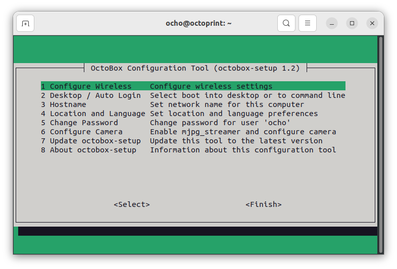

# OctoBox <a name="Intro">
An Octoprint print server running on a reimaged ChromeBox

[OctoPi](https://octoprint.org/download/#octopi) is a popular solution for running [OctoPrint](https://octoprint.org/) to control your 3D printer on an inexpensive [Raspberry Pi](https://www.raspberrypi.com/).  With the global chip shortage, Raspberry Pi boards have become virtually unobtainable without paying an exorbitant markup.

I came across a source of used Chromeboxes retired from service in a school district.  When reimaged with Linux, these little boxes are
perfect for running OctoPrint.  I've been using this setup with my Ender 3Pro for about two years now without a hitch.  If you bought
an OctoBox from me on eBay here are instructions for configuring your system.

# Table of Contents
1. [OctoBox](#Intro)
2. [Network Configuration](#NetworkConfiguration)
    1. [Wired Network](#WiredNetwork)
    2. [Wireless Network](#WirelessNetwork)
        1. [Using a Keyboard and Monitor](#KeyboardMonitor)
           1. [Configure with the Desktop GUI](#DesktopGUI)
           2. [Configure with octobox-setup](#OctoboxSetup)
        2. [Using a Wired LAN connection](#WiredLAN)
        3. [Using a Thumb Drive](#ThumbDrive)
3. [Configuring OctoPrint](#ConfiguringOctoPrint)
4. [Other OctoBox Configuration](#OtherConfiguration)
     1. [Disabling the Graphical User Interface](#DisableGUI)
     2. [Configure Camera](#ConfigureCamera)
5. [System Details](#SystemDetails)

# Network Configuration <a name="NetworkConfiguration">

The first thing you need to do is connect the OctoBox to your network.

## Wired Network <a name="WiredNetwork">

When plugged into a wired network, the OctoBox should self configure via dhcp and come up on your network as 'octoprint.local'  If you have
a convenient wired network connection near your 3D printer, this is an excellent option as it avoids any issues with spotty wireless
connections.  Simply open a browser and enter "http://octoprint.local:5000"

## Wireless Network <a name="WirelessNetwork">

To configure your OctoBox to join your wireless network, you have three options: 
1. connect a keyboard, mouse and monitor to the OctoBox and configure directly,
2. temporarily connect to a wired network and configure remotely via a terminal application, or 
3. edit a configuration file on the provided USB flash drive and insert it into your OctoBox prior to booting.

Each option is explained in greater detail below.

### Using a keyboard and monitor <a name="KeyboardMonitor">
<details>
  <summary>Click to expand!</summary>

If you have access to a keyboard, mouse and monitor this is probably the easiest and most foolproof method for configuring wireless.
Connect a monitor to either the HDMI or Displayport connection on the back of the OctoBox and plug in a USB keyboard and mouse to any
of the USB ports.  Power on the OctoBox.  It boots into a desktop environment already logged in as user 'ocho'.

From the desktop, there are two options for enabling wireless.

#### Configure with the Desktop GUI <a name="DesktopGUI">
<details>
  <summary>Click to expand!</summary>

From the desktop, click on the power button in the upper right hand corner:


Then expand the "Wi-Fi Not Connected" option and click on "Select Network"


This will bring up a new window where you can select your wireless network and enter the password.
</details>

#### Configure with octobox-setup <a name="OctoboxSetup">

<details>
  <summary>Click to expand!</summary>
Alternately you can configure using the octobox-setup script from a terminal.  To open a terminal, click on
the terminal icon in the dock on the left hand side of the screen:


This will open a new terminal window.

In the terminal, type the command

```
sudo octobox-setup
```
and hit [enter]

You will be prompted for a password.  Use the password from the sticker on the bottom of the machine.


This will run the octobox-setup script.



Navigate between options using arrow keys or the [tab] key.  Pressing [enter] will select the highlighted option.

To configure Wireless, highlight option "1 Configure Wireless" and press [enter]. The script will scan for available wireless
networks and list them in decreasing order fo signal strength.  Use the arrow or [tab] keys to select your wireless network and
press [enter].  

If your wireless network does not broadcast its SSID, highlight "Enter Manually" and press "enter"  You will be prompted to enter
the SSID of your network.

After selecting the network, you will be prompted to enter the passphrase.

</details>

</details>

### Using a wired LAN connection <a name="WiredLAN">
<details>
  <summary>Click to expand!</summary>
You can configure wireless access without a terminal and keyboard by temporarily plugging your OctoBox into a wired ethernet connection and accessing it remotely.

For remote access, you will need an ssh client.  

#### Windows
For Windows, I recommend Putty.  You can install the latest Putty client from
[the official Putty download site](https://www.chiark.greenend.org.uk/~sgtatham/putty/latest.html) or from the [Microsoft Store](https://apps.microsoft.com/store/detail/putty/XPFNZKSKLBP7RJ).

Once installed, run Putty. Enter "octoprint.local" as in the "Host Name" input field and click on the "[Open]" button.  


This will bring up a new terminal window. Log in as user "ocho" using the password from the sticker on the bottom of the Octobox.


Once logged in, enter the command 

```
sudo octobox-setup
```

You will be prompted again for the password. It is the same one used to log in (found on the bottom of the OctoBox).  This will bring up the setup menu.


Select "1 Configure Wireless"  After a scan, a list of available wireless networks will be displayed (in decreasing order of signal
strength).  Use the arrow keys to select the wireless network you wish to connect to and click "[Enter]"  You will be prompted for the password.

If your wireless network is not configured to broadcast its SSID, select "Enter Manually" and enter both the SSID and Password.

#### Mac

Mac OS X includes a command-line SSH client as part of the operating system. To use it, goto Finder and selext "Go -> Utilities" from the top menu. Then look for Terminal.
Terminal can be used to get a local terminal window from which you can create SSH connections to remote servers.

Once you have the Terminal window open type 

```
ssh ocho@octoprint.local
```

into the terminal window.  Log in as user "ocho" using the password from the sticker on the bottom of the Octobox.

Once logged in, enter the command 

```
sudo octobox-setup
```

You will be prompted again for the password. It is the same one used to log in (found on the bottom of the OctoBox).  This will bring up the setup utility.

This will bring up the setup utility.  Select "1 Configure Wireless"  After a scan, a list of available wireless networks will be displayed (in decreasing order of signal
strength).  Use the arrow keys to select the wireless network you wish to connect to and click "[Enter]"  You will be prompted for the password.

If your wireless network is not configured to broadcast its SSID, select "Enter Manually" and enter both the SSID and Password.

</details>

### Using a USB Thumb Drive <a name="ThumbDrive">
<details>
  <summary>Click to expand!</summary>

The USB flash drive included with your system contains the file octobox-config.txt.  Insert the flash drive into your computer and edit octobox-config.txt with the
text editor of your choice.

```
# OctoBox startup configuration file
#
# Lines starting with a '#' are ignored
# Do not remove the '#-' line below!
#-

SSID=mySSID
password=mypassword
#desktop=disabled
```

replace the string 'mySSID' with the name of your wireless network, and 'mypassword' with the password.  Save the file, eject the flash drive and insert it in any USB port
on your OctoBox prior to powering on.  When the system boots, it scans for any attached USB drives (or an SD card) containing the file octobox-config.txt in the top level folder. If found, it applies the options specified in the configuration file.

A word about the config file format.  The config parser tries to be agnostic about line terminators.  You can edit the file with Windows, Linux or MacOS.  As a result,
it does NOT process the config file line-by-line.  If you have a '#' character followed by any amount of whitespace (including line terminators) preceding a config
setting, the config will be considered commented out!

```
# This comment block ends in a trailing '#'
# The SSID config will not be processed!
#

SSDI=myssid
password=mypassword
```
verses:

```
# This comment block has a character after the last '#'
# thus separating the comment from the next config line.
# The SSID config will be processed.
#-

SSDI=myssid
password=mypassword
```

</details>

# Configuring OctoPrint <a name="ConfiguringOctoPrint">

Once your OctoBox is connected to your local network, from the browser of your choice enter the destination:

```
http://octoprint.local:5000
```

Ignore any warnings about an insecure connection.  OctoPrint isn’t configured for HTTPS.  The Setup Wizard should come up:


Simply go through each step of the setup process.

You will be asked to create an account.  This is separate from the user account (‘ocho’) used log into the OctoBox.  You are, however, free to use the same userid and password if you like.  Just realize that changing either password later won’t change the other.

The commands to restart OctoPrint and shut down your OctoBox are pre-configured.  Just leave these settings and click Next.

# Using OctoPrint <a name="UsingOctoPrint">

Once you have completed the Setup Wizard, each time you visit octoprint.local:5000 you will get the main OctoPrint screen.  From there you can upload .gcode files and print them.  Do Not leave an SD card in your printer when using OctoPrint!  Doing so will dramatically slow down operations.


# Other OctoBox Configuration<a name="OtherConfiguration">

The provided octobox-setup script can be used to make other configuration changes.  You can run the setup script by attaching a
monitor, keyboard and mouse to the OctoBox, or by connecting remotely via ssh.

Instructions on running octobox-setup from the graphical user interface with a monitor, keyboard and mouse can be found
[here](#OctoboxSetup)

Instructions on running via ssh from a networked computer can be found [here](#WiredLAN)

Most configuration settings should be self explanitory.

## Disabling the Graphical User Interface<a name="DisableGUI">

The graphical user interface uses few resources when enabled but not in use.  When actively printing via OctoPrint with the GUI enabled, the system load
average is less than 0.1 and the CPU is around 98% idle. If you never intend to connect your OctoBox to a keyboard and mouse, you can save some
resources by disabling the graphical user interface. This can be done from the octobox-setup script


Running the OctoPrint client UI in Firefox on the OctoBox while printing utilizes much more resources.  The system load average increases to around 1.75
and idle CPU drops to about 50%.

## Configure a camera for video<a name="ConfigureCamera">

The OctoBox comes with mjpg_streamer installed but not enabled.  You can enable the service and set the resolution and frame rate
from the octobox-setup script.

# System Details <a name="SystemDetails">

The system comes with Ubuntu 22.04.1 LTS (Jammy Jellyfish) with desktop support and the Cura slicer installed.  By default the graphical user interface is
enabled. The system will boot into a desktop environment with the user 'ocho' logged in.

There are two accounts on the system.

The user account is 'ocho' and the password is provided on an index card in the box as well as a sticker attached to the bottom of the OctoBox. You can log into this account to run Cura or a web browser to connect to the local Octoprint service.  A desktop shortcut has been installed to launch Firefox with the local OctoPrint URL.

The Octoprint service runs under the account 'octoprint'  This is a system account to run the service.  It does not have login or shell access. Sudo access is restricted
to shutting down and rebooting the system. While I STRONGLY recommend against opening access to port 5000 on your router to allow access to OctoPrint from the internet, at
least a compromized OctoPrint instance should be unable to obtain root privleges and do damage beyond restarting OctoPrint or rebooting your machine mid-print.

Octoprint was installed in a python venv at /home/octoprint/venv


